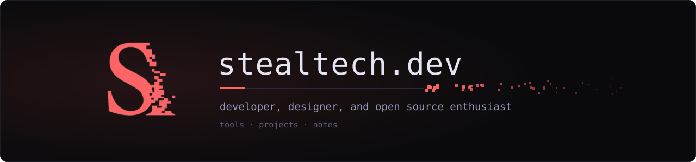

  

  

    <ul align="center" style="list-style: none">
      

        <h1>
          Hi, I'm StealTech
        </h1>
      

    </ul>
  

  
    

  

  <h2>About Me</h2>

  Passionate about building robust backend systems and scalable APIs.  
  Active contributor to open-source projects and developer communities.  
  Lifelong learner, always experimenting with new tools and languages.

    

  

    
    
    
    
    
    
     
    
    
    
    
  

  

    
    
  

  

  <h2>Stats</h2>

  
  

  

  <h2>Let's Connect</h2>

  

    
    
    
    
  

   

  <h3>
    From <a href="https://github.com/stealtech">StealTech</a> | Let's innovate together!
  </h3>

